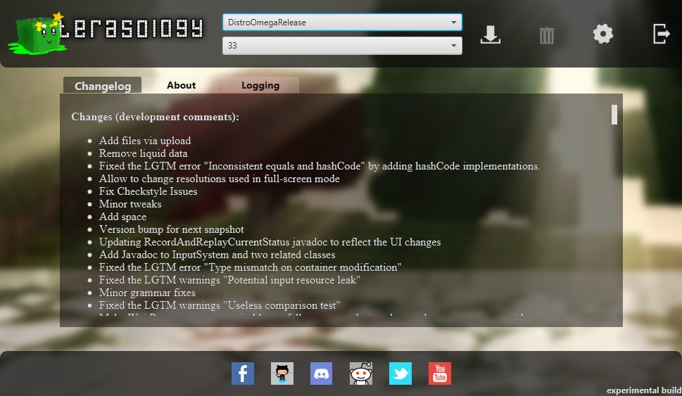
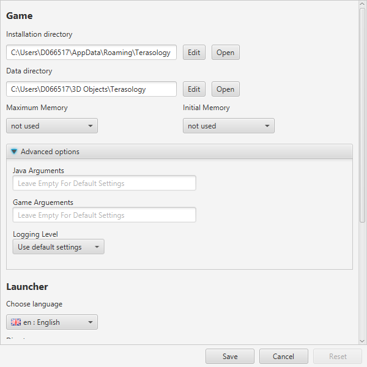

</>

    
    
    

<h3 align="center"><b>
    <a href="#community">Community</a> | 
    <a href="#installation-">Installation</a> | 
    <a href="#features">Features</a>  | 
    <a href="#development">Development</a>  | 
    <a href="#acknowledgements">Acknowledgements</a>  | 
    <a href="#license-">License</a> 
</b></h3>

[_Terasology Launcher_][github terasologylauncher] is the official launcher for the open source game [Terasology][github terasology]. It provides easy access to the different game versions and build types. Terasology and related projects are developed by a group of software enthusiast volunteers under the organization name [MovingBlocks][github movingblocks].

## Community

If you want to get in contact with the **Terasology** community and the whole **MovingBlocks** team, you can easily connect with us, share your ideas, report and solve problems.
We are present in nearly the complete round-up of social networks. Follow/friend us wherever you want, chat with us and tell the world.

&nbsp;

    
    &nbsp;&nbsp;&nbsp;&nbsp;
    
    &nbsp;&nbsp;&nbsp;&nbsp;
    
    &nbsp;&nbsp;&nbsp;&nbsp;
    
    &nbsp;&nbsp;&nbsp;&nbsp;
    
    &nbsp;&nbsp;&nbsp;&nbsp;
    
    &nbsp;&nbsp;&nbsp;&nbsp;
    
    &nbsp;&nbsp;&nbsp;&nbsp;
    
    &nbsp;&nbsp;&nbsp;&nbsp;
    

## Installation [][latest-release]

1. Download the corresponding archive for your platform from the [latest release][latest-release]
1. Extract the archive to the path where the launcher should be installed
1. Start _Terasology Launcher_

<table align="center">
  <thead align="left"><tr>
    <th width="40%">Operating System</th>
    <th width="60%">Executable</th>
  </tr></thead>
  <tr>
    <td width="40%"><b>Windows</b></td>
    <td width="60%"><code>TerasologyLauncher.exe</code> or <code>bin/TerasologyLauncher.bat</code></td>
  </tr>
  <tr>
    <td width="40%"><b>Unix, Linux, Mac OS X</b></td>
    <td width="60%"><code>bin/TerasologyLauncher</code></td>
  </tr>
</table>

## Features

On first start-up, the _Terasology Launcher_ will prompt you with the selection of the _Terasology_ installation and data directories.
The *installation directory* is the application directory of _Terasology_ and contains downloaded and extracted game packages.
The *data directory* is the place for configuration data and user-specific files such as key bindings and save games.
Note, that these directories are different from the *launcher installation directory*, which is the folder you extracted the launcher archive to.

The *Terasology Launcher UI* provides functionality to download, start, and delete different game versions. The game versions are grouped by the type of build they belong to:

<table align="center">
  <thead align="left"><tr>
    <th width="40%">Build Type</th>
    <th width="60%">Explanation</th>
  </tr></thead>
  <tr>
    <td width="40%"><b>Terasology</b></td>
    <td width="60%">Released version of Terasology core game bundled with modules</td>
  </tr>
  <tr>
    <td width="40%"><b>Terasology (nightly)</b></td>
    <td width="60%">Development build of Terasology core game bundled with modules</td>
  </tr>
  <tr>
    <td width="40%"><b>Terasology Lite</b></td>
    <td width="60%">Released version of Terasology core game only</td>
  </tr>
  <tr>
    <td width="40%"><b>Terasology Lite (nightly)</b></td>
    <td width="60%">Development build of Terasology core game only</td>
  </tr>
</table>

In addition to this main functionality, the UI displays information about new changes of the selected game version ("Changelog"), launcher information concerning changes, licensing and contribution guidelines ("About"), and logging data for the current launcher execution. Further, you have access to the social media representation of _Terasology_.

The *settings view* enables you to open the launcher installation, game installation and data directories for quick access and edit the data directory in case you want to change it after setting up the launcher. You can configure the memory settings for the game and even specify additional java or game arguments as well as the logging level for the game. Please note, that the "Initial Game Memory" and "Maximum Game Memory" setttings only apply to the game itself. The actual resource consumption may be higher due to additional resources required by the Java Virtual Machine (JVM).

The remaining settings can be used to configure the launcher. You can set the launcher language and decide whether the launcher should search for updates, close when a game is started and save downloaded game package files.

## Development

To be able to run **TerasologyLauncher** from source follow these steps. This guide is designed for [IntelliJ IDEA][intellij] (you can use the free community edition), but alternative setups are possible.

:octocat: Get Ready

 

To contribute to this repo, please open a [pull request][github forking] from your fork of this repository.

For more information on building and developing the Terasology Launcher, make sure to read the rest of this README and [CONTRIBUTING.md][contributing].

### Requirements

You'll need the following tools:

- Java SE Development Kit (JDK) 8 with JavaFX. It may be possible to use a later version of the JDK for local development, but the CI will verify against this baseline version.
- Git to clone the repo and commit changes.

Development is possible on all common platforms (Windows, Linux, MacOS) as long as the JDK with JavaFX is properly set up.
  
To generate the project files for IntelliJ, open a command prompt in the directory you checked out into and execute `gradlew idea` - this fetches the right version of Gradle and all project dependencies automatically, as well as generates the project config. Afterwards, you can simply open the project file in IntelliJ.

There is also a version for Eclipse - `gradlew eclipse` - but we encourage you to use IntelliJ.

:nerd_face: Start developing

 
    
Familiarise yourself with Git's concept of repositories, branches, and commits. To get the latest changes from your remote repositories (e.g. `movingblocks`) you need to *fetch* all remote data via `git fetch --all`. This does not change your workspace, it just loads up your local Git database.

Apart from Git, basically everything can be done using the [Gradle][gradle] [wrapper][gradle wrapper]. The following list is an excerpt of some commonly used tasks.

<table align="center">
  <thead align="left"><tr>
    <th width="50%">Command</th>
    <th width="50%"><i>Description</i></th>
  </tr></thead>
  <tr>
      <td width="50%"><code>gradlew build</code></td>
      <td width="50%"><i>Compile the source code, run tests and build a JAR.</i></td>
  </tr>
  <tr>
      <td width="50%"><code>gradlew install</code></td>
      <td width="50%"><i>Create a local runnable installation (placed in <code>./build/install/TerasologyLauncher</code>).</i></td>
  </tr>
  <tr>
      <td width="50%"><code>gradlew run</code></td>
      <td width="50%"><i>Build and run the launcher.</i></td>
  </tr>
  <tr>
      <td width="50%"><code>gradlew createRelease</code></td>
      <td width="50%"><i>Create a local development release (located in <code>./build/distributions</code>).</i></td>
  </tr>
  <tr>
      <td width="50%"><code>gradlew tasks</code></td>
      <td width="50%"><i>Display other available build script tasks.</i></td>
  </tr>
  <tr>
      <td width="50%"><code>gradlew idea`</td>
      <td width="50%"><i>Generate IntelliJ IDEA project files.</i></td>
  </tr>
</table>

Assume you have pushed some changes to your fork into a branch `myFeature`. In order to let us know about your work and give us the possibility to incorporate your changes you should send us a _pull request_. You can do this by selecting the `myFeature` branch on your GitHub repo and click the button which says "Open pull request".

More information on how to contribute can be found in [CONTRIBUTING.md][contributing]. Remember, that all submissions must be licensed under [Apache License, Version 2.0][license].

:books: Related Resources

 

Tutorials and further information on Git:

- http://www.vogella.de/articles/Git/article.html
- http://gitref.org/
- http://progit.org/

Developer setup tutorials for our main project, [**Terasology**][github terasology]:

- [Dev Setup](https://github.com/MovingBlocks/Terasology/wiki/Dev-Setup)
- [Dealing with Forks](https://github.com/MovingBlocks/Terasology/wiki/Dealing-with-Forks)

## Acknowledgements

_Terasology Launcher_ is driven by its [contributors][github terasologylauncher contributors]!

This project uses

- Font Awesome Icon for Webchat (`fa-comments`), CC BY 4.0 License, [Font Awesome Free License](https://fontawesome.com/license/free)
- [Mark James' Flag Icons Pack](http://www.famfamfam.com/lab/icons/flags/)
- [Bellsoft Liberica JRE 8](https://bell-sw.com/pages/java-8u232/) is bundled with the launcher

## License [][license]

_Terasology Launcher_ is licensed under the [Apache License, Version 2.0][license].

<!-- References -->

[latest-release]: https://github.com/MovingBlocks/TerasologyLauncher/releases/ "TerasologyLauncher (official releases)"
[license]: http://www.apache.org/licenses/LICENSE-2.0.html "Apache License, Version 2.0"
[contributing]: docs/CONTRIBUTING.md "CONTRIBUTING.md"

[github movingblocks]: https://github.com/MovingBlocks/ "MovingBlocks"
[github terasology]: https://github.com/MovingBlocks/Terasology/ "Terasology"
[github terasologylauncher]: https://github.com/MovingBlocks/TerasologyLauncher/ "TerasologyLauncher"
[github terasologylauncher contributors]: https://github.com/MovingBlocks/TerasologyLauncher/graphs/contributors/ "TerasologyLauncher contributors"

[gradle]: http://gradle.org "Gradle"
[gradle wrapper]: http://gradle.org/docs/current/userguide/gradle_wrapper.html "Gradle Wrapper"
[intellij]: http://www.jetbrains.com/idea/ "IntelliJ IDEA"
[github forking]: https://guides.github.com/activities/forking/ "GitHub Forking Guide"
