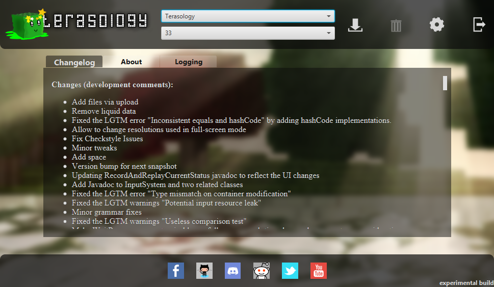
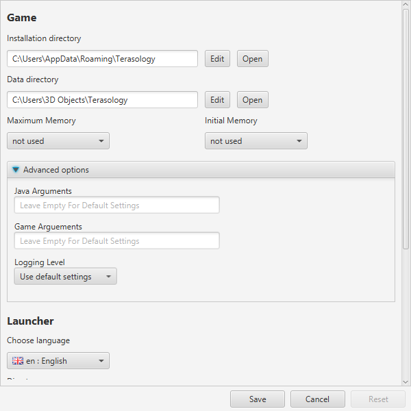

</>

    
    
    

<h3 align="center"><b>
    <a href="#community">Community</a> | 
    <a href="#installation-">Installation</a> | 
    <a href="#features">Features</a>  |
    <a href="#troubleshooting">Troubleshooting</a>  |
    <a href="#development">Development</a>  | 
    <a href="#acknowledgements">Acknowledgements</a>  | 
    <a href="#license-">License</a> 
</b></h3>

[_Terasology Launcher_][github terasologylauncher] is the official launcher for the open source game [Terasology][github terasology]. It provides easy access to the different game versions and build types. Terasology and related projects are developed by a group of software enthusiast volunteers under the organization name [MovingBlocks][github movingblocks].

## Community

If you want to get in contact with the **Terasology** community and the whole **MovingBlocks** team, you can easily connect with us, share your ideas, report and solve problems.
We are present in nearly the complete round-up of social networks. Follow/friend us wherever you want, chat with us and tell the world.

&nbsp;

    
    &nbsp;&nbsp;&nbsp;&nbsp;
    
    &nbsp;&nbsp;&nbsp;&nbsp;
    
    &nbsp;&nbsp;&nbsp;&nbsp;
    
    &nbsp;&nbsp;&nbsp;&nbsp;
    
    &nbsp;&nbsp;&nbsp;&nbsp;
    
    &nbsp;&nbsp;&nbsp;&nbsp;
    
    &nbsp;&nbsp;&nbsp;&nbsp;
    

## Installation [][latest-release]

1. Download the corresponding archive for your platform from the [latest release][latest-release]
1. Extract the archive to the path where the launcher should be installed
1. Start _Terasology Launcher_

<table align="center">
  <thead align="left"><tr>
    <th width="40%">Operating System</th>
    <th width="60%">Executable</th>
  </tr></thead>
  <tr>
    <td width="40%"><b>Windows</b></td>
    <td width="60%"><code>TerasologyLauncher.exe</code> or <code>bin/TerasologyLauncher.bat</code></td>
  </tr>
  <tr>
    <td width="40%"><b>Unix, Linux, Mac OS X</b></td>
    <td width="60%"><code>bin/TerasologyLauncher</code></td>
  </tr>
</table>

## Features

The *launcher installation directory* is the folder you extracted the launcher archive into.
This directory will also hold different versions of _Terasology_ that are installed via the launcher.

On first start-up, the _Terasology Launcher_ will prompt you with the selection of the _Terasology_ data directory.
The *data directory* is the place for configuration data and user-specific files such as key bindings and save games.
The suggested default is a new directory in the user's home directory.

The *Terasology Launcher UI* provides functionality to download, start, and delete different game versions.
The game versions are grouped by the type of build they belong to:

<table align="center">
  <thead align="left"><tr>
    <th width="40%">Build Type</th>
    <th width="60%">Explanation</th>
  </tr></thead>
  <tr>
    <td width="40%"><b>Terasology</b></td>
    <td width="60%">Released version of Terasology core game bundled with modules</td>
  </tr>  
  <tr>
    <td width="40%"><b>Terasology Lite</b></td>
    <td width="60%">Released version of Terasology core game only</td>
  </tr>
</table>

In addition to this main functionality, the UI displays information about new changes of the selected game version ("Changelog"), launcher information concerning changes, licensing and contribution guidelines ("About"), and logging data for the current launcher execution.
Further, you have access to the social media representation of _Terasology_.

The *settings view* enables you to open the launcher installation, game installation and data directories for quick access.
You can configure the memory settings for the game and even specify additional Java or game arguments as well as the logging level for the game.
Please note, that the "Initial Game Memory" and "Maximum Game Memory" settings only apply to the game itself.
The actual resource consumption may be higher due to additional resources required by the Java Virtual Machine (JVM).

The remaining settings can be used to configure the launcher.
You can set the launcher language and decide whether the launcher should search for updates, close when a game is started and save downloaded game package files.

## Troubleshooting

Find below common issues you may run into and how to resolve or work around them.
If you cannot find help for an issue you might be facing, please open a [GitHub Issue](https://github.com/MovingBlocks/TerasologyLauncher/issues/new) including the information available in the "Logging" tab.

:arrow_down: Download Issues

 

An indication of a download issue is the download starting but at some point suddenly stopping / failing.
First information about the failure can be found in the "Logging" tab.
The most common indicator you'll see there is a log message similar to "request timed out".

Downloading Terasology via the launcher can fail for multiple reasons including:
1. GitHub being unavailable
2. the Terasology artifact being unavailable
3. your internet connection being slow
4. something on your computer or in your network slowing down the download

To check whether GitHub is available, please refer to https://www.githubstatus.com/.

To check whether the Terasology artifact is available, please go to our [Terasology release page](https://github.com/MovingBlocks/Terasology/releases) and look for the version you were trying to download.
You should find it at `https://github.com/MovingBlocks/Terasology/releases/tag/v<version>`, for example, https://github.com/MovingBlocks/Terasology/releases/tag/v5.3.0.
At the bottom of the release information below the changelogs, there should be an "Asset" section.
If this section includes a `TerasologyOmega.zip` file, the Terasology artifact is available.
If not, please open up a [GitHub Issue](https://github.com/MovingBlocks/TerasologyLauncher/issues/new) or inform us about this on [Discord](https://discord.gg/terasology).

If the Terasology artifact and GitHub are available, but your download timed out, this is likely due to a slow internet connection or something on your computer or in your network slowing down the download.
In this case, you can either try to hunt down the issue yourself or try to work around the issue manually

### Manual Download Timeout Workaround

You can work around the launcher's timeout logic by downloading the Terasology artifact manually.

Workaround steps:
1. Download the desired Terasology artifact from GitHub: `https://github.com/MovingBlocks/Terasology/releases/download/v<version>/TerasologyOmega.zip`
2. Extract the artifact (zip archive)
3. Rename the archive 
   For stable releases to `terasology-omega-<version>-stable.zip`, for example, `terasology-omega-5.3.0-stable.zip` 
   For nightly and pre-releases to `terasology-omega-<version>-nightly.zip`, for example, `terasology-omega-5.3.0-rc.2-nightly.zip`
4. Copy the renamed archive into the `cache` directory located in the launcher managed directory 
   On Windows: `C:\Users\AppData\Roaming\TerasologyLauncher\cache` 
   On Linux/Unix: `/home/<user>/.terasologylauncher`
5. Start the launcher and select the version you downloaded the artifact for, click on the download icon (:arrow_down:) and wait for the download to complete.
   This should happen quickly as the launcher should use the already downloaded Terasology artifact from the cache. 
   On completion the download icon (:arrow_down:) should turn into a play icon (:arrow_forward:)
6. Click on the play icon (:arrow_forward:) to start Terasology

## Development

To be able to run **TerasologyLauncher** from source follow these steps.
This guide is designed for [IntelliJ IDEA][intellij] (you can use the free community edition), but alternative setups are possible.

:octocat: Get Ready

 

To contribute to this repo, please open a [pull request][github guide] from your fork of this repository.

For more information on building and developing the Terasology Launcher, make sure to read the rest of this README and [CONTRIBUTING.md][contributing].

### Requirements

You'll need the following tools:

- Java SE Development Kit (JDK) 11. It should be possible to use a later version of the JDK for local development, please see the definition of [push validation] for the exact CI setup.
- Git to clone the repo and commit changes.

Development is possible on all common platforms (Windows, Linux, MacOS).

:nerd_face: Start developing

 
    
Familiarise yourself with Git's concept of repositories, branches, and commits. To get the latest changes from remote repositories you need to *fetch* all remote data via `git fetch --all`. This does not change your workspace, it just loads up your local Git database.

Apart from Git, basically everything can be done using the [Gradle][gradle] [wrapper][gradle wrapper]. The following list is an excerpt of some commonly used tasks.

<table align="center">
  <thead align="left"><tr>
    <th width="50%">Command</th>
    <th width="50%"><i>Description</i></th>
  </tr></thead>
  <tr>
      <td width="50%"><code>gradlew build</code></td>
      <td width="50%"><i>Compile the source code, run tests and build a JAR.</i></td>
  </tr>
  <tr>
      <td width="50%"><code>gradlew install</code></td>
      <td width="50%"><i>Create a local runnable installation (placed in <code>./build/install/TerasologyLauncher</code>).</i></td>
  </tr>
  <tr>
      <td width="50%"><code>gradlew run</code></td>
      <td width="50%"><i>Build and run the launcher.</i></td>
  </tr>
  <tr>
      <td width="50%"><code>gradlew createRelease</code></td>
      <td width="50%"><i>Create a local development release (located in <code>./build/distributions</code>).</i></td>
  </tr>
  <tr>
      <td width="50%"><code>gradlew tasks</code></td>
      <td width="50%"><i>Display other available build script tasks.</i></td>
  </tr>
</table>

Assume you have pushed some changes to your fork into a branch `myFeature`.
In order to let us know about your work and give us the possibility to incorporate your changes you should send us a _pull request_.
You can do this by selecting the `myFeature` branch on your GitHub repo and click the button which says "Open pull request".

More information on how to contribute can be found in [CONTRIBUTING.md][contributing].
Remember, that all submissions must be licensed under [Apache License, Version 2.0][license].

:flags: Translation

 

If you want to contribute by translating the Terasology Launcher to a new language or by improving an existing translation check out the [Translation Guide](./docs/i18n.md).

:books: Related Resources

 

Tutorials and further information on Git:

- http://www.vogella.de/articles/Git/article.html
- http://gitref.org/
- http://progit.org/

Developer setup tutorials for our main project, [**Terasology**][github terasology]:

- [Contributor Quick Start Guide](https://github.com/MovingBlocks/Terasology/wiki/Contributor-Quick-Start)
- [Dealing with Forks](https://github.com/MovingBlocks/Terasology/wiki/Dealing-with-Forks)

## Acknowledgements

_Terasology Launcher_ is driven by its [contributors][github terasologylauncher contributors]!

This project uses

- Font Awesome Icon for Webchat (`fa-comments`), CC BY 4.0 License, [Font Awesome Free License](https://fontawesome.com/license/free)
- [Mark James' Flag Icons Pack](http://www.famfamfam.com/lab/icons/flags/)
- [Bellsoft Liberica JDK 11](https://bell-sw.com/pages/downloads/#/java-11-lts) is bundled with the launcher

## License [][license]

_Terasology Launcher_ is licensed under the [Apache License, Version 2.0][license].

<!-- References -->

[latest-release]: https://github.com/MovingBlocks/TerasologyLauncher/releases/ "TerasologyLauncher (official releases)"
[license]: http://www.apache.org/licenses/LICENSE-2.0.html "Apache License, Version 2.0"
[contributing]: docs/CONTRIBUTING.md "CONTRIBUTING.md"
[push validation]: .github/workflows/push-validation.yml

[github movingblocks]: https://github.com/MovingBlocks/ "MovingBlocks"
[github terasology]: https://github.com/MovingBlocks/Terasology/ "Terasology"
[github terasologylauncher]: https://github.com/MovingBlocks/TerasologyLauncher/ "TerasologyLauncher"
[github terasologylauncher contributors]: https://github.com/MovingBlocks/TerasologyLauncher/graphs/contributors/ "TerasologyLauncher contributors"

[gradle]: http://gradle.org "Gradle"
[gradle wrapper]: http://gradle.org/docs/current/userguide/gradle_wrapper.html "Gradle Wrapper"
[intellij]: http://www.jetbrains.com/idea/ "IntelliJ IDEA"

[github guide]: https://docs.github.com/en/get-started/quickstart/contributing-to-projects "GitHub Contributing to projects"
