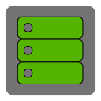

Welcome to **TerasologyLauncher** &mdash; the official game launcher for [Terasology](https://github.com/MovingBlocks/Terasology/)!

This wiki is the main source for *developers*, *contributors* and *users* of the TerasologyLauncher project. 
The launcher is part of the open source community around Terasology and provides easy access to the game. 

## Overview

|[Getting Started](Getting-Started.md)|[Community &amp; Contact](Community.md)|[Setup Guide](Setup-Guide.md)|[Technical Documentation](Documentation.md)|
|:-----------------------------------:|:-------------------------------------:|:---------------------------:|:-----------------------------------------:|
|||||
|Information for end users on how to get, start and use the launcher.|Check out this section to get more information or get in touch with us!|A step-by-step guide on how to set-up and run TerasologyLauncher from source.|In-depth information about the techniques used in TerasologyLauncher.|

## License
__TerasologyLauncher__ is licensed under the [Apache License, Version 2.0](http://www.apache.org/licenses/LICENSE-2.0.html).
